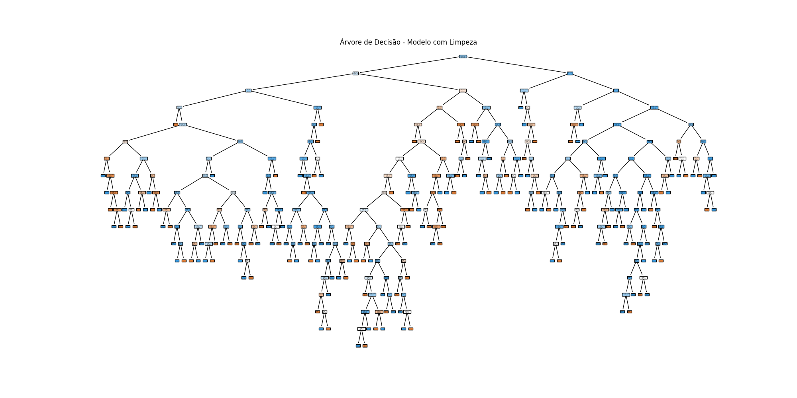

# INF1038 - Aprendizado Automático
### Professora: Karla Figueiredo

## 📝 Trabalho: Análise com Árvores de Decisão na base German Credit

Este projeto aplica um classificador **Decision Tree** e outros algoritmos na base de crédito alemão, testando os impactos de diferentes pré-processamentos e seleção de atributos, conforme os métodos abordados em aula:

- Análise descritiva dos dados (tipo, escala e cardinalidade)
- Limpeza de dados (valores ausentes e possíveis outliers)
- Normalização
- Discretização supervisionada
- Seleção de variáveis com base em:
  - Chi²
  - Correlação de Pearson
  - Importância da Árvore
  - RFE com Regressão Logística

## 🌳 Visualização da Árvore de Decisão

Abaixo, a árvore gerada pelo modelo após limpeza de dados:



## 📊 Resultados

### Fase 1:
- Modelo base: **Acurácia = 0.66**, Recall “bad” = 0.48
- Modelo com limpeza: **Acurácia = 0.71**, Recall “bad” = 0.51
- Modelo com normalização: **Acurácia = 0.71**, Recall “bad” = 0.52
- Modelo com discretização: **Acurácia = 0.63**, Recall “bad” = 0.43

### Fase 2 (melhorias com RFE e múltiplos modelos):
- Decision Tree (balanced): **Acurácia = 0.673**, Recall “bad” = 0.389
- Random Forest (balanced): **Acurácia = 0.737**, Recall “bad” = 0.344
- Naive Bayes: **Acurácia = 0.727**, Recall “bad” = 0.400
- kNN (k=7): **Acurácia = 0.733**, **Recall “bad” = 0.422**

## 📂 Estrutura dos Arquivos

- `main.py` — executa os modelos da fase 1
- `modelagem_trab2.py` — script principal com melhorias da fase 2
- `describe_base.py` — análise da base de dados
- `model_base.py`, `model_limpeza.py`, `model_normalizacao.py`, `model_discretizacao.py` — versões da fase 1
- `class_german_credit.csv` — base de dados
- `requirements.txt` — dependências
- `relatorio_resultados.txt` — resultados da fase 1
- `relatorio_trabalho2.txt` — resultados e conclusões da fase 2 (melhorias)

## ▶️ Como Executar

```bash
pip install -r requirements.txt
python3 main.py                # Executa fase 1
python3 modelagem_trab2.py     # Executa fase 2 (melhorias)
```
